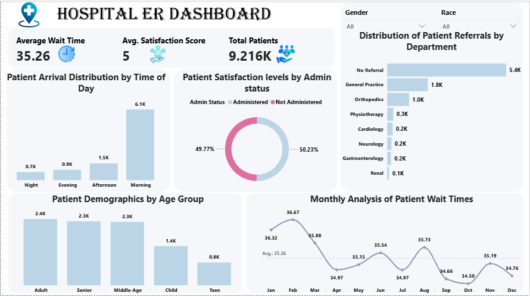

## Hospital ER Dashboard (Power BI)

An interactive Power BI dashboard that analyses patient flow in a hospital emergency room: arrival times, wait times, referrals, satisfaction and patient demographics.

Author: Felix Ukamaka Peace
[LinkedIn](https://www.linkedin.com/in/ukamaka-felix-4160993ab) | [Portfolio](https://felix-ukamaka-peace.lovable.app) | [Medium](https://medium.com/@beautyfelix6)

## Project Overview
Hospital emergency rooms need to understand when patients arrive, how long they wait and how satisfied they are, so that staff and resources can be planned well. This project cleans a raw ER dataset in Power Query and turns it into a one-page dashboard that answers those questions.

## Business Questions
1. When do patients arrive at the ER?
2. How long do patients wait, and does this change by month?
3. Which departments receive the most referrals?
4. Who are the patients (age group, gender, race)?
5. How satisfied are patients, and how many were administered?

## Tools Used
- *Power BI* for visuals, slicers and report design
- *Power Query* for data cleaning and transformation
- *Excel* for the raw data

## Dataset
- Raw data and cleaned data files are included in this repository
- Total records after cleaning: *9,216 patients*

## Data Cleaning Steps (Power Query)
All cleaning was done in Power Query. In total there are 39 applied steps, grouped here by purpose:

*1. Loading and structure*
- Connected to the source file and selected the correct table (Source, Navigation)
- Promoted the first row to column headers
- Split a combined column into separate columns using a delimiter
- Removed columns that were not needed for the analysis

*2. Data types*
- Changed data types to the correct ones (text, whole number, decimal, date and time)
- Used "Change Type with Locale" to convert date and time values correctly
- Renamed columns to clear, consistent names

*3. Date and time features*
- Extracted the Hour, Month, Month Name and Day Name from the date and time column
- Extracted the first characters of text values to create short labels (for example, short month and day names)

*4. Cleaning values and rows*
- Filtered out blank, invalid and unwanted rows (several filter steps)
- Replaced incorrect or inconsistent values
- Merged columns where two fields were needed as one
- Removed duplicate records

*5. Grouping with conditional columns*
- Added conditional columns to turn raw values into useful groups, for example arrival time into Morning, Afternoon, Evening and Night, and ages into age groups
- Changed the data types of the new columns
- Applied final filters and renaming so the data was ready for reporting

## Dashboard Features
- *KPI cards:* average wait time, average satisfaction score, total patients
- *Patient arrival distribution* by time of day
- *Patient satisfaction levels* by administered status (donut chart)
- *Patient referrals* by department
- *Patient demographics* by age group
- *Monthly analysis* of patient wait times
- *Gender and Race slicers* to filter the whole page

## Key Insights
- *Patient volume:* 9,216 patients were seen, with an average wait time of about 35 minutes.
- *Arrival pattern:* Morning is by far the busiest period with about 6.1K patients (roughly two thirds of all arrivals), followed by Afternoon (1.5K), Evening (0.9K) and Night (0.7K).
- *Referrals:* About 5.4K patients (over half) came with no referral. General Practice (1.8K) and Orthopedics (1.0K) received the most referrals. Physiotherapy, Cardiology, Neurology, Gastroenterology and Renal each received 0.3K or fewer.
- *Demographics:* Adults (2.4K), Seniors (2.3K) and Middle-aged patients (2.3K) account for most visits. Children make up 1.4K and Teens 0.8K.
- *Wait times:* Monthly average wait stayed fairly steady, between about 34.5 and 36.7 minutes. It peaked in February (36.67) and was lowest in October (34.50).
- *Satisfaction:* The average satisfaction score is 5. Patients are split almost evenly between Administered (50.23%) and Not Administered (49.77%).

## Recommendations
- Schedule more staff in the morning, when most patients arrive.
- Look into why over half of patients arrive without a referral, and whether a stronger patient assessment or primary care pathway would help.
- Investigate what caused the longer waits in February and apply what worked in October.

## Repository Contents
- README.md: project documentation
- dashboard.png: dashboard preview
- Power BI file (.pbix): the full interactive dashboard
- Raw dataset and cleaned dataset

## Contact
Felix Ukamaka Peace | beautyfelix6@gmail.com
